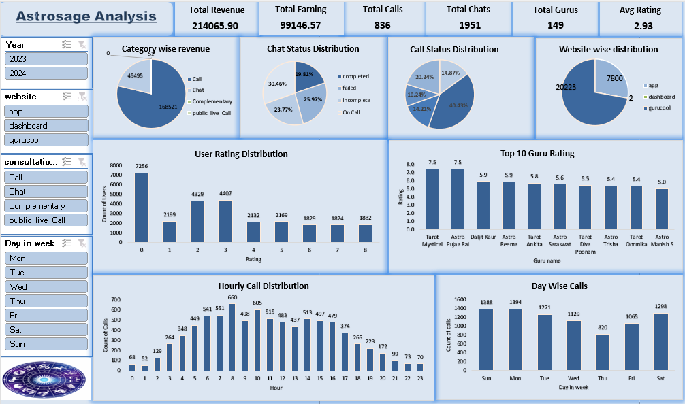

# 📊 Astrosage Call Center Analysis

## 🔍 Project Overview
This project analyzes the call center operations of AstroSage, focusing on improving efficiency, customer satisfaction, and revenue using data-driven insights.

---

## 🎯 Problem Statement
AstroSage received ₹1 crore investment and needs to decide how to allocate it effectively to:
- Improve customer satisfaction  
- Increase operational efficiency  
- Maximize profitability  

---

## 🛠️ Tools Used
- Microsoft Excel  
- Pivot Tables  
- Data Cleaning  
- Data Visualization  

---

## 📈 Key Insights
- Calls generate higher revenue than chats  
- Around 60% calls and 50% chats are incomplete  
- Most user ratings are below 3  
- Peak call hours: 5 AM – 4 PM  
- Highest demand: Sunday & Monday  

---

## 📊 Dashboard Features
- Total Revenue  
- Total Calls & Chats  
- Average Rating  
- Guru Performance  
- Call & Chat Status Distribution  
- Hourly & Daily Trends  

---

## 💡 Recommendations
- Upgrade call center technology  
- Improve agent training  
- Implement AI chatbots  
- Optimize workload distribution  
- Reduce failed calls  

---

## 💰 Investment Strategy
- Technology Upgrade – 40%  
- Training – 20%  
- Hiring – 15%  
- Customer Experience – 10%  
- Infrastructure – 10%  
- Reserve – 5%  

---

## 📌 Conclusion
The analysis shows that AstroSage handles a high volume of users but lacks efficiency. Improving technology and training can significantly boost performance and customer satisfaction.
